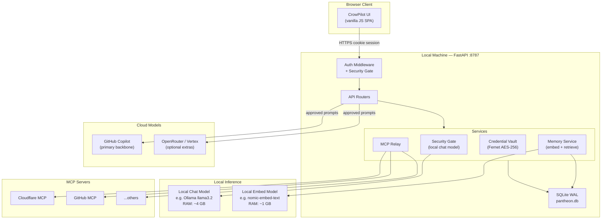
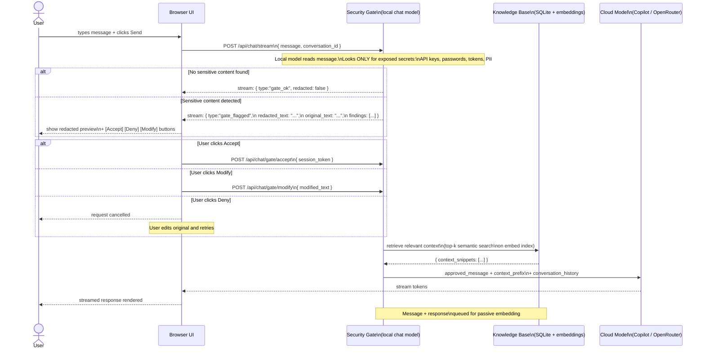
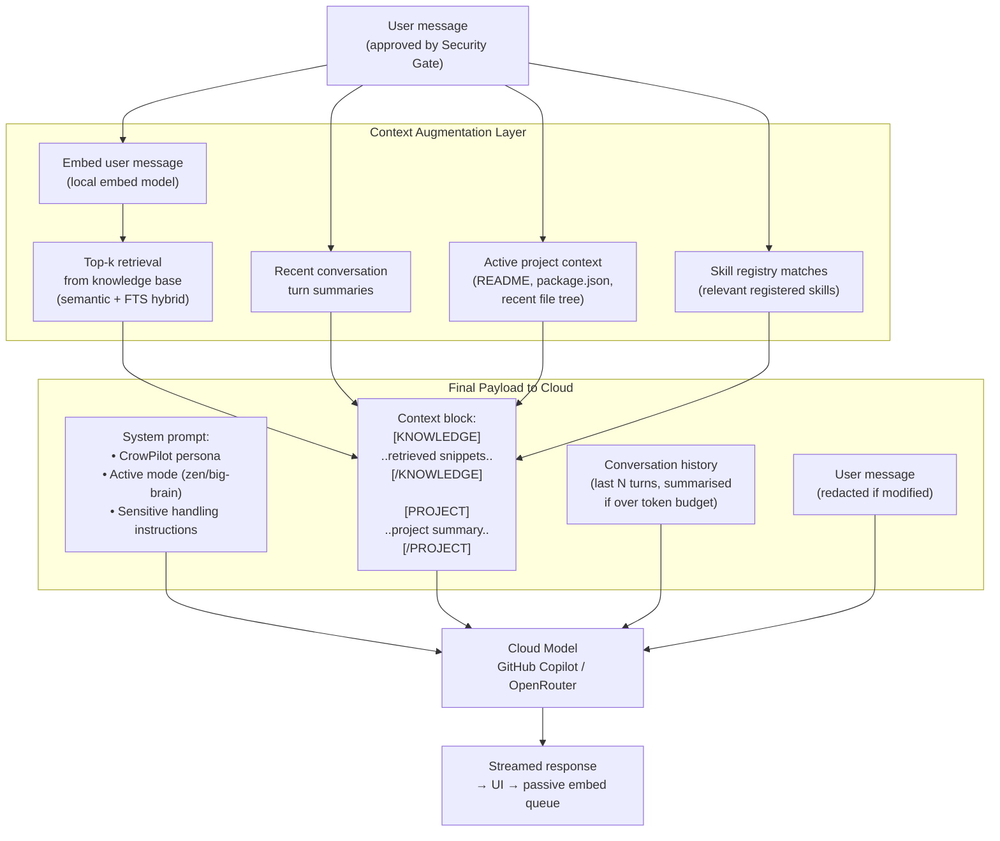
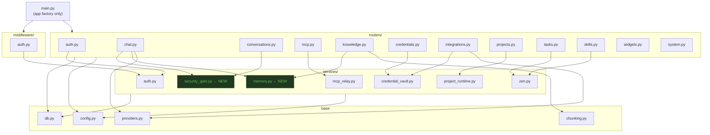
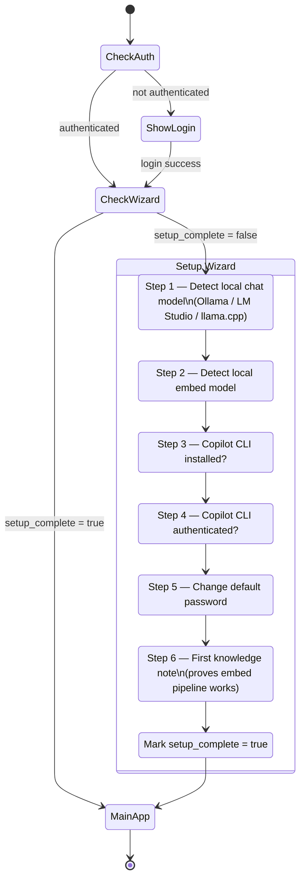
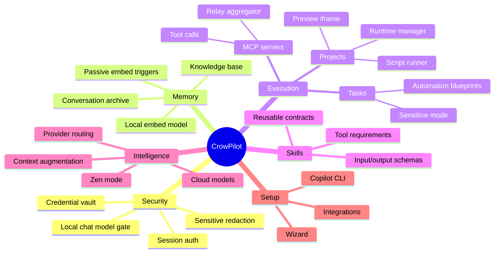

# CrowPilot — Master Plan: Codebase Stabilization & Architecture

## Current State Assessment

| File | Lines | Problem |
|------|-------|---------|
| `backend/app/main.py` | **3 585** | Every router, service, helper, middleware, and startup logic in one file |
| `backend/app/schemas.py` | ~120 | Mixed domain models, not organized by feature |
| `backend/app/db.py` | ~230 | Schema + migration helpers — mostly fine |
| `backend/app/providers.py` | ~80 | Fine |
| `backend/app/chunking.py` | ~40 | Fine |

### Violations in `main.py`

- **No separation of concerns** — route handlers, business logic, data access, and startup all co-located
- **DRY failures** — `_serialize_*` functions, credential resolution, zen-prompt dispatch all repeated inline patterns
- **No service layer** — crypto, embedding, MCP relay, project process management all in global module scope
- **Impossible to unit-test** — every function depends on module-level globals (`DB_CONN`, `PROVIDERS`, `CREDENTIAL_CIPHER`)
- **Auth middleware co-located with routes** — hard to change independently
- **No background task system** — embed calls block request threads

---

## Target Structure

```
backend/app/
├── main.py                   ← slim: create app, add middleware, include routers
├── config.py                 ← keep as-is
├── db.py                     ← keep; add typed repo helpers per domain
├── schemas.py                ← split into schemas/<domain>.py
├── chunking.py               ← keep as-is
├── providers.py              ← keep as-is
│
├── routers/                  ← one file per domain, uses APIRouter
│   ├── __init__.py
│   ├── auth.py               ← /api/auth/*
│   ├── chat.py               ← /api/chat/stream  (security gate integrated here)
│   ├── conversations.py      ← /api/conversations/*
│   ├── mcp.py                ← /api/mcp/* + /mcp relay
│   ├── knowledge.py          ← /api/notes/*
│   ├── credentials.py        ← /api/credentials/*
│   ├── integrations.py       ← /api/integrations/*
│   ├── projects.py           ← /api/projects/*
│   ├── tasks.py              ← /api/tasks/*
│   ├── skills.py             ← /api/skills/*
│   ├── widgets.py            ← /api/widgets/*
│   ├── sensitive.py          ← /api/sensitive/*
│   └── system.py             ← /api/health, /api/hub/*, /api/dashboard/*
│
├── services/                 ← pure business logic, no FastAPI deps
│   ├── __init__.py
│   ├── auth.py               ← hash_password, verify_password, get_session_user, seed_user
│   ├── credential_vault.py   ← Fernet encrypt/decrypt, ref resolution
│   ├── security_gate.py      ← LOCAL MODEL pre-screen: detect secrets, stream 3-action response
│   ├── memory.py             ← embed, retrieve, augment_prompt, passive_embed_worker
│   ├── mcp_relay.py          ← relay_list_tools, relay_call_tool, check_server_status
│   ├── project_runtime.py    ← start/stop/log project child processes
│   └── zen.py                ← zen prompt dispatch, JSON extraction helpers
│
├── middleware/
│   ├── __init__.py
│   └── auth.py               ← session cookie enforcement middleware
│
└── wizard/                   ← NEW: setup wizard backend
    ├── __init__.py
    └── router.py             ← /api/wizard/* — onboarding steps, model detection, CLI checks
```

### Migration Order (safest path)

1. **Phase 1 — Extract services** (no route changes, pure extraction)
   - `services/auth.py` ← move `_hash_password`, `_verify_password`, `_get_session_user`, `_seed_default_user`
   - `services/credential_vault.py` ← move `_encrypt_secret`, `_decrypt_secret`, `_vault_key_path`, `_resolve_credential_secret_by_ref`
   - `services/project_runtime.py` ← move `_start_project_runtime`, `_stop_runtime`, `_list_project_runtimes`, `_runtime_logs`
   - `services/zen.py` ← move `_build_zen_messages`, `_extract_json_object`, `_get_zen_provider`, `_fallback_zen_plan`
   - `services/mcp_relay.py` ← move `_relay_list_tools`, `_relay_call_tool`, `_run_protocol_checks_for_server`

2. **Phase 2 — Extract routers** (one at a time, verify after each)
   - Start with `routers/auth.py` (already isolated), then `routers/system.py`, `routers/knowledge.py`
   - End with the most complex: `routers/projects.py`, `routers/chat.py`

3. **Phase 3 — Build new services** (new capabilities, not renames)
   - `services/security_gate.py` — local model pre-screen pipeline
   - `services/memory.py` — embed worker + retrieval (replaces `_fetch_memory_context`)
   - `wizard/router.py` — setup wizard

4. **Phase 4 — Split schemas.py**
   - `schemas/auth.py`, `schemas/chat.py`, `schemas/mcp.py`, etc.

---

## Setup Wizard Requirements

Every new install must complete before the app is fully usable:

| Step | Check | Action |
|------|-------|--------|
| 1 | Local chat model reachable | Detect Ollama / LM Studio / llama.cpp at common ports; prompt to install if missing |
| 2 | Local embed model reachable | Same detection; required for knowledge base and passive memory |
| 3 | GitHub Copilot CLI installed | `gh copilot --version`; provide install instructions if missing |
| 4 | Copilot CLI authenticated | `gh auth status`; launch browser auth if needed |
| 5 | Admin password changed | Prompt to set a real password if still `Di@m0nd$ky` default |
| 6 | First knowledge note | Walk user through saving one note to prove embed pipeline works |

Wizard state stored in `users.setup_complete` (new column). Unauthenticated users and incomplete-setup users are redirected to the wizard overlay before seeing the main app.

---

---

## Data Architecture & Flow Diagrams

---

### 1 — System Context (what runs where)



---

### 2 — Security Gate: Every Chat Request

Every user message passes through this pipeline before any cloud model sees it.



---

### 3 — Passive Memory Pipeline (always running)

The embed model runs asynchronously. User never waits for it.

```mermaid
flowchart LR
    subgraph Triggers["Embedding Triggers"]
        T1["Chat turn completed"]
        T2["Note saved"]
        T3["Task/Skill created"]
        T4["MCP tool result"]
        T5["Project file indexed"]
        T6["Conversation archived"]
    end

    subgraph Worker["Embed Worker\n(background asyncio queue)"]
        Q["Async queue\n(in-memory)"]
        CHUNK["Text chunker\n(512-token windows\n64-token overlap)"]
        EMB["Local Embed Model\nnomic-embed-text\nor mxbai-embed-large"]
    end

    subgraph Store["SQLite Knowledge Store"]
        NC["note_chunks table"]
        FTS["note_chunks_fts\n(FTS5 full-text)"]
        VEC["Planned: vec0 extension\nor external FAISS index\nfor dense retrieval"]
    end

    T1 & T2 & T3 & T4 & T5 & T6 --> Q
    Q --> CHUNK --> EMB
    EMB --> NC
    NC --> FTS
    NC --> VEC

    style Worker fill:#142014,stroke:#375c37
    style Store fill:#0b160b,stroke:#1f361f
```



---

### 4 — Context Augmentation (what goes to the cloud)

The cloud model never sees a naked user message. It always receives curated context.



---

### 5 — Proposed Module Dependency Graph



---

### 6 — Security Gate: Internal Model Prompt Design

```mermaid
flowchart TD
    IN["User input text"]
    
    subgraph LOCAL["Local Chat Model (isolated, no network)"]
        PROMPT["System prompt:\nYou are a security filter.\nYou have ONE job: detect exposed secrets.\nSecrets = API keys, passwords, tokens, private keys, PII.\nReturn JSON only:\n{ found: bool, redacted_text: str, findings: [str] }"]
        INFER["Inference\n(~200ms on local GPU\nor ~1s on CPU)"]
    end

    RESULT{found?}

    NO["Pass through as-is\nto augmentation layer"]
    YES["Return to UI:\n• redacted_text shown\n• findings listed\n• 3 action buttons rendered"]

    IN --> PROMPT --> INFER --> RESULT
    RESULT -- No secrets found --> NO
    RESULT -- Secrets detected --> YES

    style LOCAL fill:#0b160b,stroke:#375c37
```



---

### 7 — Wizard: New User Onboarding Flow



---

## Feature Cohesion Map

Right now features feel disconnected. Here's how they are *supposed* to relate:



---

## UI Work Items (separate from backend stabilization)

| Section | Gap | Plan |
|---------|-----|------|
| **Chat** | Scattered across views in cards | Persistent right-panel chat (collapsible, fixed to all views) |
| **Credentials** | No zen mode | Zen prompt: "Store my Cloudflare API token" → infer name/type/provider |
| **Integrations** | No zen mode | Zen prompt: "Connect OpenRouter with my API key" → infer all fields |
| **Projects** | No zen mode | Zen prompt: "Import my ~/projects folder as workspaces" |
| **Security Gate** | Not built | New inline review panel in chat area |
| **Setup Wizard** | Not built | Full-screen overlay before main app, persistent state |
| **Embed status** | Invisible | Persistent footer badge: "📎 Embedding..." indicator |

---

## Immediate Next Steps (ordered by risk/impact)

1. **Refactor Phase 1** — Extract `services/` layer (no user-visible change, de-risks everything else)
2. **Build `services/memory.py`** — Replace current inline `_fetch_memory_context` with proper async worker
3. **Build `services/security_gate.py`** — Core differentiator; needs local model config in wizard
4. **Setup wizard backend** — `wizard/router.py`, add `setup_complete` column to users table
5. **Persistent chat panel** — Right sidebar that renders on every view
6. **Zen modes for Credentials/Integrations/Projects**
7. **Refactor Phase 2** — Extract routers
